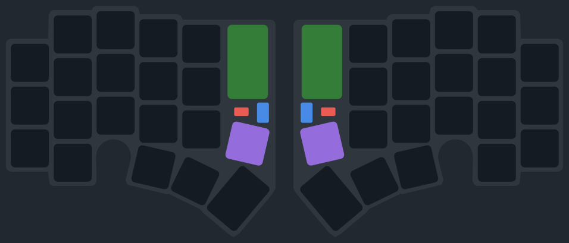

# Scoot

A wired, low-latency, 36–42-key split ergonomic keyboard where **the entire right half is a physical desk mouse**.

A Corne 3×6+3 layout — with a **detachable outer column**, so it runs as 5 or 6 columns per hand (36 or 42 keys) — driven by a **single** controller. There's no second microcontroller — the right half carries only its keys plus pointing/scroll hardware, all wired back to the left half over a tether. Electrically it behaves like one unibody board that happens to be physically split.

<p align="center">
  
</p>

> <sub>Physical layout ([`docs/scoot-layout.svg`](docs/scoot-layout.svg)) — a hand-built SVG in GitHub's dark palette.</sub>

> **Status: concept.** This repo is currently just the idea and its open questions — no firmware, no PCB, no case. Implementation comes after the concept is settled.

## The core bets

- **One controller, two halves.** A single MCU on the left half reads every key, both encoders, and the mouse sensor directly — matrix and peripheral lines cross the tether. No split-link protocol, no inter-half sync latency.
- **The right half *is* the mouse.** An optical sensor mounts face-down on the bottom plate; you pick up the right half and move it on the desk to drive the cursor — instead of a trackball or trackpad.
- **Dedicated scroll + media.** A roller wheel on the right half is a pure scroll wheel; a rotary encoder on the left handles volume / play-pause.
- **Wired and fast.** Targets 1000 Hz polling — favoring latency and simplicity over wireless.

## Prior art

Scoot stands on two open-source keyboards:

- **[Corne / crkbd](https://github.com/foostan/crkbd)** — the 3×6 + 3-thumb split layout Scoot adopts. Following the Corne's column options, Scoot's **outer (6th) column is detachable**, so each half runs as **5 or 6 columns** plus the thumb cluster (36 or 42 keys total).
- **[Cheapino](https://github.com/tompi/cheapino)** — the single-controller idea: one MCU reads both halves, with no second brain. The Cheapino carries its inter-half matrix over an **Ethernet cable**; Scoot uses a **full USB-C tether** instead — it has to carry the mouse-sensor SPI and roller lines too, not just the matrix.

## Hardware sketch

| Part | Role |
| --- | --- |
| Waveshare RP2040-Zero | Sole controller, left half |
| PMW3360 breakout (lens included) | Desk-mouse sensor, right half, face-down |
| EC11 rotary encoder | Left half — volume / play-pause |
| EVQVYA001 roller encoder | Right half — scroll wheel (no click) |
| USB-C ↔ USB-C tether | Carries matrix + peripheral + power between halves |

### Does it fit? (feasibility)

Two constraints decide whether the single-controller idea actually works:

- **Matrix size.** 42 keys + the encoder click need a grid of at least that many nodes (`rows × cols ≥ 43`). A **6×8 = 48-node** matrix covers it with headroom — left finger keys on rows 0–2, right on rows 3–5, thumbs sharing a column. Dropping the detachable outer column just leaves those nodes unpopulated (down to 36 keys); the matrix is unchanged.
- **GPIO budget.** Everything has to land on the RP2040-Zero's pins:

  | Subsystem | Pins |
  | --- | --- |
  | Matrix (6 rows + 8 cols) | 14 |
  | Mouse sensor (SPI) | 4 |
  | Left encoder (A/B) | 2 |
  | Right roller (A/B) | 2 |
  | **Total** | **22** |

  The Zero breaks out ~20 pins on its edge castellations plus more on underside pads, so 22 fits — but it's tight, and that tightness is itself a design constraint to keep in mind.

## Decisions made so far

- **Pointing method: the desk-mouse.** Committed. The right half moving on the desk *is* the cursor — we accept the engineering that makes it usable (see below) as the price of the concept, rather than retreating to a trackball or trackpad.
- **Not a true split.** One controller, not a second smart half — simpler and lower-latency. The right half carries only one *dumb* IO expander (no firmware), so it's still a single-MCU design.
- **6×8 matrix.** Chosen over tighter grids so 42 keys + the encoder click fit with a few spare nodes.
- **Detachable outer column** (after Corne). The 6th column unplugs, so Scoot can be a 42-key (6-col) or 36-key (5-col) board. The matrix and pin budget are sized for the 42-key max.
- **PMW3360, not PAW3204.** The PAW3204 is an OEM part that isn't realistically buyable. The PMW3360 sells as an assembled breakout *with the lens fitted* and speaks standard 4-wire SPI.
- **Fingerprint pass-through: integrated USB hub.** Committed. A USB 2.0 hub IC on the left half puts the keyboard and the dongle behind one cable (see *USB architecture*). The original "tap the spare D+/D-" idea can't work — the RP2040 has a single USB PHY.
- **Bare RP2040, fab-assembled.** On the left, routed cleanly into the hub. JLCPCB's assembly service solders it, so the reflow isn't ours to do. (The RP2040-Zero module + USB jumper is the conservative fallback.)
- **IO expander on the right (MCP23017).** Scans the right matrix locally so only ~10 conductors cross the tether — which lets the slim USB-C cable fit. Still one MCU (an expander has no firmware). See [docs/schematic.md](docs/schematic.md).

## Interaction model

Typing and mousing share the same right hand, so they're separated by a **hold-to-mouse** mode:

- **Hold a left thumb key** to enter mouse mode; release to return to typing. The left half stays planted, so that key is always under your thumb — no state to forget, no false triggers.
- **While held, the right half becomes the mouse.** Slide it to move the cursor. Its finger keys are **remapped** (not disabled) to Left / Right / Middle click — so resting your hand doesn't actuate, but a press does, exactly like mouse buttons.
- **Left-hand modifiers stay live** (Ctrl / Shift / Alt) → Ctrl-click, Shift-click and click-drag work without leaving the board.
- **The roller always scrolls**, in either mode — it's a dedicated wheel, independent of mouse mode.

## USB architecture

One cable to the computer; a USB 2.0 hub IC on the left half fans it out to the keyboard and the fingerprint dongle:

```
host PC
  │  USB-C
  ▼
┌──────────────────────────┐
│  USB 2.0 hub IC (left)   │   bus-powered, 4-port (e.g. FE1.1s / SL2.1A)
└───┬──────────────┬───────┘
    │ downstream 1  │ downstream 2
    ▼               ▼
  RP2040         USB-A jack → fingerprint dongle   (+ 2 spare ports)
```

- The dongle is enumerated by the **host**, entirely around the firmware — QMK never sees it.
- The hub sits on the USB *data path*, **not** the RP2040's GPIO, so it doesn't touch the pin budget.
- It lives on the planted left half, so it doesn't burden the roaming tether.
- New externals it brings in: the hub's crystal + caps, a host-side USB-C connector with CC pulldown resistors, and per-port power/ESD.

## Making the desk-mouse work

The pointing method is committed, so these are the problems that decide whether it's actually usable:

1. **Accidental clicks while gripping.** With the interaction model settled (hold-to-mouse, see above), the residual risk is that keyboard switches actuate lighter than mouse buttons — and you grip hard to slide. The remapped click keys may need heavier springs, or the buttons assigned to keys you *don't* grip. Tune on a prototype.
2. **The roaming-half tether.** Unlike a normal split, the right half *moves around* — so the inter-half cable must flex and extend across the entire mousing range without tugging the cursor or dragging the left half. Likely a coiled/retractable cable or a generous service loop. With the right-half expander it carries only ~10 conductors (I²C + sensor SPI + roller + power), which fits a USB-C cable — see [docs/schematic.md](docs/schematic.md).
3. **Re-homing.** The mouse is also your right-hand typing surface — after pointing you have to put it back in a repeatable spot. By feel, a tactile detent, or a physical dock/outline on the desk mat.
4. **Glide, window, Z-height.** The bottom plate needs low-friction skates, a clean optical window for the lens, and the ~10 mm sensor standoff — while still feeling like a keyboard, not a brick.
5. **Clutching fatigue.** Like any mouse you'll lift and reposition when you run out of desk; doing that with a keyboard half is heavier than a mouse, so it's worth prototyping for comfort early.

## Other open questions

- **MCU packaging — resolved: bare RP2040.** Fab-assembled on a custom PCB for clean USB routing into the hub. (The Zero module + USB jumper remains the conservative fallback.) See [docs/schematic.md](docs/schematic.md).
- **Mousing handedness.** The right half is the mouse — fine for right-handers; no plan yet for left-handed mousing.

## Roadmap (rough)

1. **Concept** — core architecture settled (this README).
2. **Block diagram + tether/conductor plan** — done.
3. **Breadboard prototype** — prove the core on dev modules, no PCB ([docs/breadboard.md](docs/breadboard.md)) ← we are here.
4. **Schematic + PCB** — net-level capture drafted ([docs/schematic.md](docs/schematic.md)); lay out once the breadboard validates it.
5. Case / bottom-plate design (sensor window, glide surface).
6. Firmware.

## License

Documentation and design materials: [CC BY 4.0](LICENSE). Hardware design files (when added) will carry a hardware-appropriate license such as CERN-OHL.
