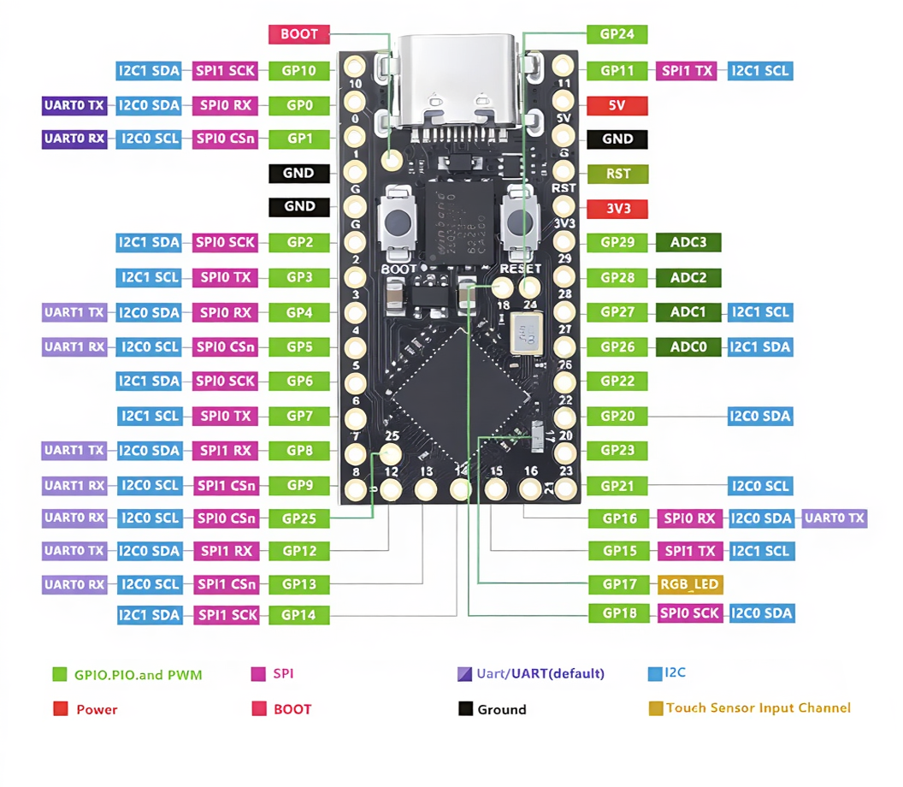

# MCU — Tenstar RP2040 "Pro Micro"

The controller Scoot uses (one per half): the generic **Tenstar Robot "RP2040 Pro Micro"**
— the cheapest Pro-Micro-shaped RP2040 (~US$3–5 on AliExpress). It is poorly documented,
so this page is the consolidated, cross-checked reference for its real pinout and quirks.

**Source / confirmation:** the facts below are reconciled against the vendor pinout render
and the community survey **[bgkendall/keyboard_mcu_list](https://github.com/bgkendall/keyboard_mcu_list)**
(see its "RP2040 Pro Micro (Tenstar Robot/Generic)" row).

## Pinout (top view, USB at top)

Vendor pinout image, added for reference (source:
[keycapsss.com](https://keycapsss.com/media/da/b2/b3/1762952293/rp2040-pro-micro-controller-16mb-pinout.png)):



> **Heads-up — the LED is NOT RGB.** The image labels GP17 as `RGB_LED`, but the on-board
> LED on this module is a **single-color red LED**, not an addressable RGB. It cannot drive
> our SK6812 chain (and GP17 has no exposed pad anyway — see below).

A simplified, function-oriented view of the same board (schematic, not mechanical —
`GP18/GP24` are the center pads, `GP25` sits at the bottom-left, `GP12–GP16` the bottom row):

```
                        ┌───────────────┐
                 BOOT ● │     USB-C     │
                        └───────┬───────┘
      ╔═════════════════════════╪═════════════════════════╗
 GP10 ║ ●10                                           11● ║ GP11
  GP0 ║ ●0                                            5V● ║ 5V  (RAW)
  GP1 ║ ●1                                           GND● ║ GND
  GND ║ ●G                                           RST● ║ RST
  GND ║ ●G                                           3V3● ║ 3V3 (VCC)
  GP2 ║ ●2         ┌─── center pads ───┐              29● ║ GP29 ·ADC3
  GP3 ║ ●3         │  ●GP18    ●GP24   │              28● ║ GP28 ·ADC2
  GP4 ║ ●4         │       ●GP25       │              27● ║ GP27 ·ADC1
  GP5 ║ ●5         └───────────────────┘              26● ║ GP26 ·ADC0
  GP6 ║ ●6                                            22● ║ GP22
  GP7 ║ ●7     GP17 → on-board LED  (NO PAD)          20● ║ GP20
  GP8 ║ ●8     GP19 → VBUS detect   (NO PAD)          23● ║ GP23
  GP9 ║ ●9                                            21● ║ GP21
      ╚═══●12═════●13═════●14═════●15═════●16═════════════╝
          GP12    GP13    GP14    GP15    GP16
```

Legend: `●` = a solderable/socketable THT pad. `GP18/GP24/GP25` are the three **center
pads** (normal pads, not castellated edges — GP25 is the isolated one, GP18/GP24 a pair).
`GP17` and `GP19` are **internal only, no pad** (see below). Positions are schematic, not
mechanical — verify against your physical module before laying out a board.

## Usable GPIO = 28 (not the "26" the listing claims)

The RP2040 has **30 GPIO** (GP0–GP29). This module exposes all but two:

| Pin | State | Why |
| --- | --- | --- |
| **GP17** | no pad | Hard-wired to the on-board LED (a single **red** LED, despite the "RGB" silk — unusable as an addressable-LED data line). |
| **GP19** | no pad | Tied to the on-board **VBUS-detect** circuit. |

So **30 − 2 = 28 usable GPIO.** The AliExpress listing and `keyboard_mcu_list`'s summary
say "26", but that number is wrong — the list's own breakdown (18 + 5 + 2 + 3) sums to 28,
and counting the exposed pads independently also gives 28.

### Where the 28 live

| Group | Pads | GPIO |
| --- | --- | --- |
| Left column | GP10, GP0, GP1, GP2–GP9 | 11 |
| Right column | GP11, GP29, GP28, GP27, GP26, GP22, GP20, GP23, GP21 | 9 |
| Bottom row | GP12, GP13, GP14, GP15, GP16 | 5 |
| Center pads | GP18, GP24, GP25 | 3 |
| **Total** | | **28** |

Power/other pads (not GPIO): `5V` (RAW), `3V3` (VCC), `GND` ×3, `RST`, `BOOT`.
`GP26–GP29` double as ADC0–ADC3.

## Flash — 4 MB is plenty, 16 MB is overkill

The module ships in 4 MB and 16 MB variants. A full QMK build for Scoot (core + split +
RGB Matrix with the whole effect catalog + PMW33xx pointing driver + hold-to-mouse layer)
is well under **~512 KB** — 4 MB leaves 6–8× headroom. QMK keeps no filesystem or large
assets in flash, and flash *size* does not affect XIP speed. **Pick 4 MB** for cost and use
the **same size on both halves**. Bigger only matters for out-of-scope experiments (audio
samples, logging, RMK/ZMK tinkering).

## Boot — no combined reset/boot button

`keyboard_mcu_list` marks this board **`1-Btn. Boot = No`**: it has **two separate on-board
buttons, BOOT and RESET**, so an off-board reset button alone cannot enter the bootloader.

- **First flash:** hold the on-board **BOOT** + tap **RESET** (or hold BOOT while plugging
  USB) → the board mounts as a UF2 drive; drag the `.uf2`.
- **After that:** QMK's `RP2040_BOOTLOADER_DOUBLE_TAP_RESET` (a firmware feature that works
  on any RP2040, independent of this hardware) makes a **double-tap of the reset button**
  enter the bootloader. The `QK_BOOT` keycode also works. → a board-level reset switch is
  worth having; it becomes the day-to-day reflash button.

## VBUS detect — GP19

`keyboard_mcu_list` lists **VBUS Det. = GPIO19** (footnote: undocumented, but the circuitry
is present and reported working). This is *why* GP19 has no pad — it is consumed by the
VBUS-sense circuit. It's a **free feature, not a loss**: QMK's `SPLIT_USB_DETECT` uses it to
auto-pick the primary half (central = VBUS present → primary; peripheral = tether-powered,
no host USB → secondary). If it turns out not to work on a given unit, fall back to
`EE_HANDS` (handedness stored in each half's emulated EEPROM at flash time — costs no pin).

## ⚠️ Quality caveat — verify GP26–GP29

`keyboard_mcu_list` warns that **some Tenstar units ship with mis-placed components that
leave GP26–GP29 non-functional** ("check for misaligned components in product photos").
GP26–GP29 are 4 of the 28 usable pins, so **test them on the physical unit before committing
a board layout** — flash a minimal firmware that toggles/reads each and confirm. If they
fail, that unit can't host a design that needs them; source a good unit rather than
switching module family (alternatives in the list expose *fewer* GPIO, and most don't break
out GP26–GP29 at all).

---

## Resolved Scoot pin assignment

The live assignment lives in the ergogen [`config.yml`](../config.yml) (`mcu` footprint params).
The 18 keys take GP0–GP16 + GP18; the roller (RE_A/RE_B) GP21/GP22, LED data GP20, UART tether
GP23. The **peripheral-only mouse sensor** (a PMW3360/3389 breakout, connected by cable to a
JST-SH 8-pin header — `xonha/sensor_connector_jst_sh`) uses the remaining pins:

| Sensor line | GPIO | RP2040 SPI1 |
| --- | --- | --- |
| SCLK | GP26 | SCK |
| MOSI | GP27 | TX |
| MISO | GP28 | RX |
| NCS  | GP29 | (CS driven as a plain GPIO) |
| MOT (motion IRQ, optional) | GP24 | — |
| RS (sensor reset, optional) | GP25 | — |

SCLK/MOSI/MISO land on RP2040 **SPI1**, so QMK can use hardware SPI. On the central build the
connector footprint is unpopulated and these pins are free. The breakout mounts on the bottom
plate at the glide surface; the cable keeps its Z-height decoupled from the main PCB (~10 mm
standoff) and off the crowded bottom face — see the README "Decisions".
